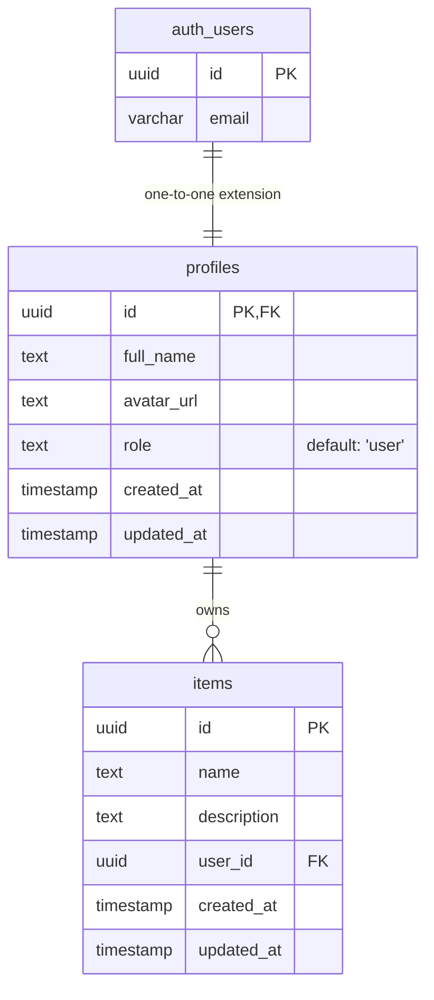

# System Architecture

## 1. High-Level Overview

The application is a **serverless-first, Jamstack-style full-stack app**: a Next.js application deployed on Vercel serves both the frontend (React, server-rendered and static where possible) and the backend API (Next.js Route Handlers, running as Vercel serverless/edge functions), backed by Supabase for auth, database, storage, and Realtime.

```
                            ┌─────────────────────────────┐
                            │           Browser            │
                            │   (React client + SSR pages) │
                            └───────────────┬──────────────┘
                                            │ HTTPS
                                            ▼
                     ┌──────────────────────────────────────┐
                     │              Vercel Edge              │
                     │  ┌────────────┐   ┌─────────────────┐ │
                     │  │  Next.js    │   │ Route Handlers  │ │
                     │  │  Pages/SSR  │   │ (API layer)     │ │
                     │  └─────┬──────┘   └────────┬────────┘ │
                     │        │  middleware.ts     │          │
                     │        │  (auth guard)       │          │
                     └────────┼─────────────────────┼─────────┘
                              │                      │
              ┌───────────────┴──────┐    ┌──────────┴───────────┐
              ▼                       ▼    ▼                      ▼
      ┌───────────────┐   ┌───────────────────┐        ┌───────────────────┐
      │ Supabase Auth  │   │ Supabase Postgres  │        │ Email API (Resend  │
      │ (JWT sessions) │   │ + Row Level Security│        │ / dev-tier provider│
      └───────────────┘   └───────────────────┘        └───────────────────┘
                              ▲
                              │
                    ┌─────────┴─────────┐
                    │ Supabase Storage    │
                    │ (files/avatars, RLS)│
                    └────────────────────┘

      GitHub  ──push/PR──▶ GitHub Actions (lint/test/build/audit) ──▶ Vercel Deploy
```

## 2. Component Responsibilities

| Component | Responsibility | Owned by |
|---|---|---|
| Next.js Pages/SSR | Rendering UI, server components fetching data | App code |
| Route Handlers (`app/api/*`) | Server-side API surface, validation, orchestration | App code |
| `middleware.ts` | Auth/session check, route protection, redirects | App code (shared, not per-route) |
| Supabase Auth | Identity, session issuance (JWT), OAuth, password reset tokens | Supabase (managed) |
| Supabase Postgres | System of record, enforced via RLS | Supabase (managed) |
| Supabase Storage | File/blob storage (avatars, uploads), enforced via RLS-like storage policies | Supabase (managed) |
| Email API | Transactional email delivery | Third-party (Resend, free tier) |
| GitHub Actions | CI gate: lint, type-check, test, build, dependency audit | GitHub (managed) |
| Vercel | Hosting, edge network, atomic deploys, preview environments | Vercel (managed) |

## 3. Data Flow

### 3.1 Authenticated request (typical case)
1. Browser sends a request with the Supabase session cookie/JWT.
2. `middleware.ts` intercepts the request, validates the JWT (signature + expiry) using Supabase's helper libraries, and attaches the resolved user/role to the request context. Unauthenticated requests to protected routes are redirected (pages) or rejected with 401 (API).
3. The Route Handler performs its own authorization check appropriate to the action (e.g., "is this user the owner of this resource, or an admin?") — middleware handles *authentication*, handlers handle fine-grained *authorization*. This is a deliberate two-layer check: never rely on middleware alone for record-level access control.
4. The handler validates the request body/params against a Zod schema. Invalid input is rejected with 400 before touching the database.
5. The handler calls Supabase's Postgres via the Supabase client, using the **user's own JWT**, not a service-role key — so RLS is enforced by the database itself as a second, independent layer of authorization, even if the API layer had a bug.
6. The response is returned; sensitive fields are never included by default (explicit allow-list serialization, not "return the whole row").

### 3.2 Notification flow
1. An action that should trigger an email (e.g., signup) completes its primary database write first.
2. The handler calls the notification abstraction (`lib/notifications/`), which enqueues/dispatches the email asynchronously.
3. If the email provider call fails, it is logged with enough context to retry or alert — the original user-facing request has already succeeded and is not blocked or rolled back because of an email failure (per FR-13).

### 3.3 CI/CD flow
1. Developer opens a PR against `main`.
2. GitHub Actions runs lint, type-check, unit/integration tests, build, and a dependency vulnerability scan.
3. On success, Vercel automatically builds a **preview deployment** tied to the PR, using staging-equivalent environment variables (non-production Supabase project).
4. On merge to `main`, the same pipeline runs again, and Vercel promotes/deploys to **production** using production environment variables and the production Supabase project.
5. Database migrations are applied as an explicit, separate step (not implicitly triggered by deploy) via the Supabase CLI, so schema changes are reviewable and sequenced deliberately relative to code deploys (see `deployment.md` for exact ordering/rollback strategy).

## 4. Security Architecture

### 4.1 Authentication
- Delegated entirely to Supabase Auth. The application never stores or hashes passwords itself.
- Sessions are JWT-based, short-lived access tokens with refresh tokens, handled via Supabase's SSR-aware client helpers so cookies are `httpOnly` and `secure` in non-dev environments.

### 4.2 Authorization — defense in depth
Two independent layers, deliberately redundant:
1. **Application layer:** `middleware.ts` + per-handler role/ownership checks.
2. **Database layer:** Postgres Row Level Security policies keyed to `auth.uid()` and a `role` claim, so even a compromised or buggy API layer cannot read/write rows it shouldn't — the database is the final enforcement point, not just the API.

### 4.3 Data protection
- TLS everywhere (enforced by Vercel and Supabase by default; the app never accepts plain HTTP).
- Secrets live in Vercel's encrypted environment variable store and Supabase's project settings — never in the repository. `.env.example` documents *names*, never real values.
- PII fields are minimized in the schema; any field not needed for a stated feature is not collected (per NFR-21).
- Database backups are handled by Supabase's managed backup feature (point-in-time recovery on paid tiers; manual periodic export recommended on the free tier as a stated limitation).

### 4.4 API security
- Input validation on every route via shared Zod schemas.
- Output allow-listing: API responses explicitly shape returned objects rather than passing database rows straight through, preventing accidental over-exposure when new columns are added later.
- Rate limiting applied at the edge (see `security.md` for implementation options) with stricter thresholds on `/api/auth/*` routes.
- CORS restricted to known origins per environment — the production API does not accept cross-origin requests from arbitrary domains.

### 4.5 Secret management by environment
- **Dev:** local `.env.local`, gitignored, populated from `.env.example`; local Supabase CLI stack uses its own throwaway local keys.
- **Staging:** Vercel Preview environment variables, pointing to a dedicated Supabase *staging* project (never production data).
- **Production:** Vercel Production environment variables, pointing to the Supabase *production* project, with the most restrictive access.

## 5. Integration Points

### 5.1 Supabase
- **Auth:** identity, session, OAuth provider config.
- **Postgres:** system of record, migrations managed via Supabase CLI, RLS on every table.
- **Storage:** file uploads (e.g., avatars), governed by storage policies analogous to RLS.
- **Edge Functions (optional, as needed):** for logic that must run close to the database or independent of the Vercel deploy lifecycle (e.g., scheduled cleanup jobs).

### 5.2 Email API
- A free/developer-tier transactional email provider (recommended: **Resend**, with **SendGrid free tier** or **Mailgun free tier** as fallbacks — see `programmingstack.md` §"Email Provider Rationale").
- Integrated through a thin internal abstraction (`lib/notifications/`) so swapping providers later touches one module, not every call site.

### 5.3 Vercel
- Hosts the Next.js app as both static/SSR frontend and serverless API.
- Provides automatic preview deployments per PR (this *is* the staging mechanism for code review, distinct from the persistent "staging" environment used for QA — see `deployment.md` for how these relate).
- Manages environment variables per environment (Development/Preview/Production).

### 5.4 GitHub
- Source of truth for code; branch protection on `main` requires passing CI + review.
- GitHub Actions runs the CI pipeline; GitHub Secrets store any credentials the pipeline itself needs (e.g., a Supabase access token for running migrations in CI).

## 6. Extensibility Model

New features follow a fixed shape (detailed in `directory_structure.md`):
```
feature module = schema/migration + Zod validation schema + Route Handler(s) + UI components
```
Because auth, middleware, validation conventions, and the notification abstraction are already generic and shared, a new module never needs to modify core infrastructure — it only adds new files under its own directory and a new migration. This is what makes the "no restructuring" objective concrete rather than aspirational.

## 7. Database Schema & Relationships (ERD)

The relational data model enforces referential integrity and strict security bounds at the database tier using Row-Level Security (RLS).



### 7.1 Table Definitions & Metadata

#### `auth.users` (External / Supabase Auth)
Managed natively by Supabase. Stores authentication credentials, cryptographically hashed passwords, and token metadata.

#### `public.profiles`
Extends `auth.users` via a one-to-one cascading relationship. Controls application-level authorization details and user-profile data.
* **Fields**:
  * `id` (`uuid`, Primary Key): References `auth.users(id)` with `ON DELETE CASCADE`.
  * `full_name` (`text`, Nullable).
  * `avatar_url` (`text`, Nullable).
  * `role` (`text`, Not Null, Default `'user'`): User access classification. Standard roles: `user`, `admin`.
  * `created_at` / `updated_at` (`timestamp with time zone`, Not Null, Default `now()`).

#### `public.items`
Sample feature module CRUD table. Contains user-owned assets.
* **Fields**:
  * `id` (`uuid`, Primary Key): Generated using `gen_random_uuid()`.
  * `name` (`text`, Not Null): Asset name.
  * `description` (`text`, Nullable).
  * `user_id` (`uuid`, Not Null, Foreign Key): References `public.profiles(id)` with `ON DELETE CASCADE`.
  * `created_at` / `updated_at` (`timestamp with time zone`, Not Null, Default `now()`).

